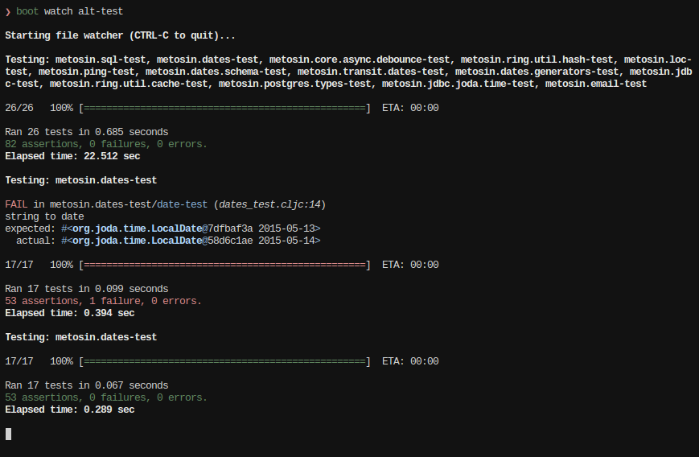

# Boot-alt-test 

Fast Clojure.test runner for Boot.

## Features

- **Requires tools.namespace 0.3.0-alpha3**
- Uses [eftest](https://github.com/weavejester/eftest) to display pretty reports
- When used with Boot watch task, uses [clojure.tools.namespace](https://github.com/clojure/tools.namespace) to reload
changed namespaces and to run only the tests in changed or affected namespaces
- When fails the next tasks are not run but no exception is shown
- Option to throw an exception when tests fail (use on CI to exit process with failure)
- Tries to recover from namespace reload errors so that no process restart is needed
    - This means that after some exceptions all the namespaces have to reloaded
    - Related: ([CTN-6](http://dev.clojure.org/jira/browse/TNS-6), [CTN-24](http://dev.clojure.org/jira/browse/TNS-24))
- Run all tests by hitting `enter`
- Can optionally run tests parallel
- Two hooks to manage test environment
    - `on-start` hook: run a function before any tests are run
    - `on-end` hook: run a function after all tests are run

## TODO / Ideas

- Provide option to run all the tests instead of just changed/affected namespaces
- Maybe provide a way to run all the tests from REPL? Nrepl middleware?
- Junit output
- Check if it would make any sense to merge the improvements to boot-test?
- [Cloverage](https://github.com/lshift/cloverage) integration
- A way to disable unloading/reloading of certain namespaces? Is it required?

## License

Copyright © 2016 Juho Teperi

Distributed under the Eclipse Public License either version 1.0 or (at your option) any later version.
